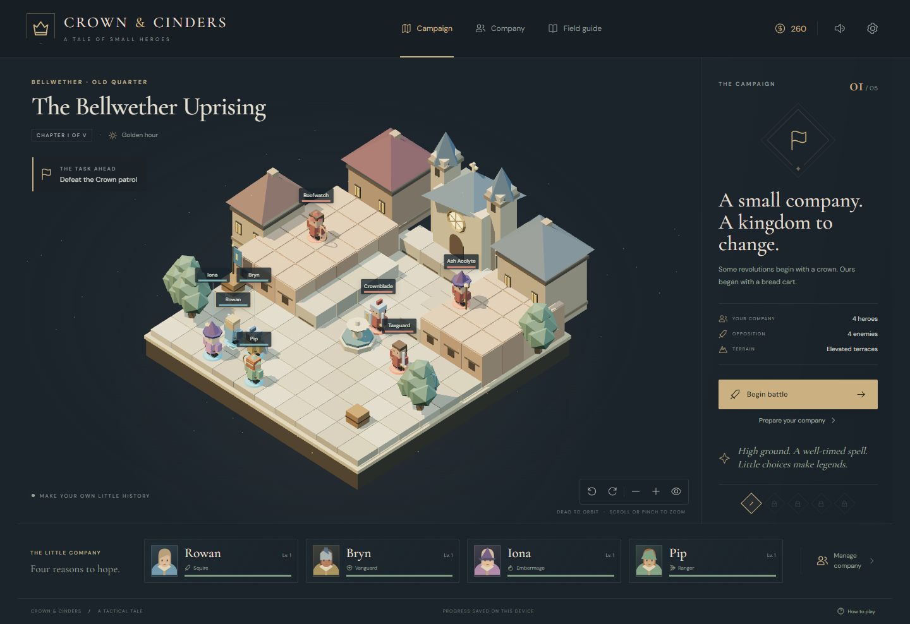

# Crown & Cinders

**A small company. A kingdom to change.**

An original, finished single-player browser tactical RPG inspired by Final Fantasy Tactics. Lead Rowan, Bryn, Iona, and Pip through a five-chapter uprising in the terraced city of Bellwether. Every model, character, line of dialogue, portrait, and musical phrase was made for this project.



## Play locally

Requires Node.js 24+ and pnpm 12.5.1 (declared in `package.json`).

```sh
pnpm install
pnpm dev
```

Open **http://127.0.0.1:5173/**. The game has no backend, accounts, API keys, or network-dependent assets. Use a local server; opening `index.html` directly is not supported. WebGPU requires localhost or HTTPS.

```sh
pnpm build
pnpm preview
```

The `dist/` directory is a portable static site with relative asset paths, suitable for subdirectory hosting.

## The game

- Five authored encounters, original story scenes, chapter rewards, a final boss, and a complete ending. Cleared chapters remain replayable for training.
- Four persistent heroes; seven jobs: Squire, Vanguard, Ranger, Embermage, Mender, Pugilist, and Chronist. Combine a primary job with a secondary discipline, spend JP on permanent skills, and level up through battle actions.
- Separate move and action resources, reversible movement before acting, facing, flanks, elevation, jump limits, ranged line of sight, and an initiative queue driven by speed and charge time.
- Charged spells target a fixed tile. Area magic can hit allies. Damage forecasts include terrain, facing, armor, Guard, and charging vulnerability. Attacks are deterministic once their target is valid.
- Healing, revival, consumables, poison, Haste, Slow, Rally, armor reduction, counterattacks, and magic resistance. Fallen heroes can be revived for 30 clock ticks; a fallen company can retry without losing campaign progress.
- Three weapon upgrades, three armor upgrades, equipment charms, a supply shop, and deployment order.
- Enemies use the same movement, targeting, MP, charging, and status rules. Their planner evaluates damage, healing, revivals, terrain, spacing, and active spell danger.
- Automatic local saves, battle resumption, validated JSON save import/export, difficulty choices, audio controls, animation speed, reduced motion, and graphics quality settings.

The opening patrol introduces the rules. Later chapters reward preparation: spend JP, purchase equipment, and replay cleared encounters when your company needs training. **Story** difficulty reduces enemy HP and power; change it between battles in Settings.

## Controls

| Action | Touch / mouse | Keyboard |
| --- | --- | --- |
| Move | Move → blue tile → confirm | M, arrow keys, Enter |
| Attack | Attack → target → confirm | A, arrow keys, Enter |
| Abilities / items | Choose an ability → target → confirm | Tab between controls |
| End turn | Guard / End turn → facing → confirm | W, Tab / Enter |
| Inspect | Tap a unit or turn portrait | Tab / Enter |
| Orbit | Drag, or rotate buttons | Q / E |
| Zoom | Pinch, scroll, or + / − | Tab to camera controls |
| Cancel | Back / Cancel | Escape |

Mobile battles keep the board visible above an independently scrollable command panel. The field guide explains all mechanics in-game.

## Rendering

- **Primary:** Three.js **r186** `WebGPURenderer`, with native WebGPU when available.
- **Fallback:** the same current renderer’s WebGL2 backend.
- **Compatibility:** separately lazy-loaded Three.js r162 `WebGLRenderer` with an explicitly requested **WebGL1** context. Modern Three.js removed WebGL1 in r163; no modern-only shader code runs on this path.
- Low-poly procedural geometry, batched static meshes, orthographic camera, warm/cool lighting, real-time shadows, ACES tone mapping, MSAA, ambient motes, animated figurines, and a TSL bloom pipeline on the native WebGPU desktop/high-quality path.
- Automatic mobile pixel-ratio cap; low quality reduces resolution and renders at roughly 30 Hz. Paused rendering when the page is hidden. Local, bundled fonts and original synthesized audio.

Force a fallback for testing:

```text
http://127.0.0.1:5173/?renderer=webgl2
http://127.0.0.1:5173/?renderer=webgl1
```

Settings reports the **actual initialized backend**, rather than relying on the presence of `navigator.gpu`. Samsung S26-class phones and RTX 4070 Super-class desktops are the design targets; automated mobile viewport checks are not a substitute for physical-device performance measurements.

## Verification

```sh
pnpm typecheck
pnpm test
pnpm build
pnpm test:e2e
```

Local browser tests use installed Google Chrome. CI uses Playwright Chromium. The engine suite covers rules, map validity, saves, and a complete campaign route through legal battles, training, and upgrades. Browser tests exercise actual controls, touch layouts, customization, save/resume, a complete opening battle, rewards, defeat/retry, and both fallback renderers. Tests never mutate the live game through an autoplay/debug backdoor.

The browser exposes a read-only `window.__CINDERS__` snapshot and tile projection for diagnostics. This does not expose a mutable engine or bypass progression.

See [validation results](docs/VALIDATION.md), [portrait mobile play](docs/screenshots/mobile.png), and the [river crossing](docs/screenshots/bridge.png).

## Project structure

| File | Responsibility |
| --- | --- |
| `src/data.ts` | Jobs, skills, heroes, chapters, and maps |
| `src/engine.ts` | Deterministic battle rules, enemy planner, campaign progression |
| `src/view.ts` | Renderers, original geometry, picking, camera, and effects |
| `src/main.ts` | Game flow, menus, input, story, rewards, and settings |
| `src/save.ts` | Persistence and import validation |
| `src/audio.ts` | Procedural effects and original ambient music |
| `tests/` | Engine and browser verification |

## References and scope

This is an original tactical RPG built around a city-uprising sequence, not a reproduction of Final Fantasy Tactics’ copyrighted campaign or assets. The source game informs the tactical language: stacked terrain, small parties, jobs, facing, and charge time. See [research notes](docs/RESEARCH.md) for guide attribution and rendering references.

Code and original project assets are available under the MIT license. Bundled dependencies and fonts retain their own licenses, copied into [public/licenses/](public/licenses/) and the production build.
